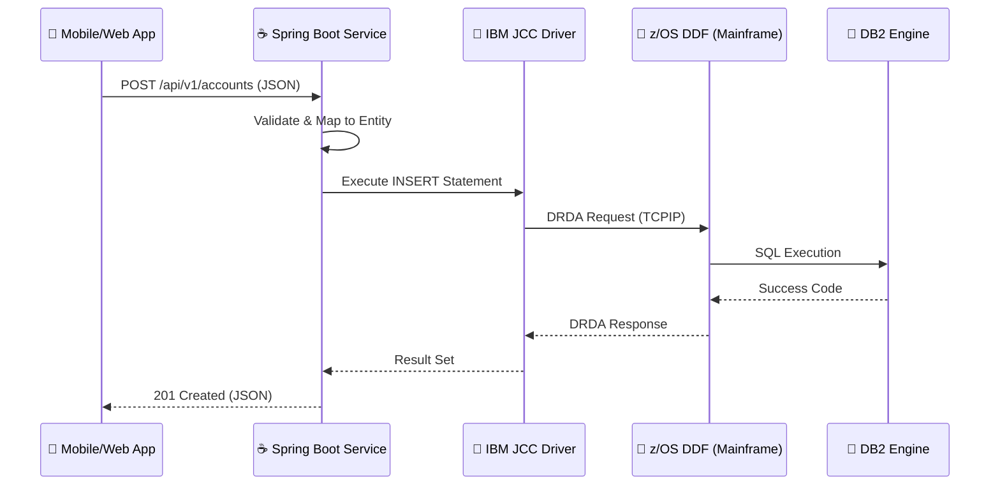

# 🏛️ ZenithBank: Enterprise Mainframe-to-Microservice Bridge

[](https://spring.io/projects/spring-boot)
[](https://www.oracle.com/java/)
[](https://www.ibm.com/it-infrastructure/z/os)
[](https://www.ibm.com/products/db2)
[](LICENSE)

## 🌟 Executive Summary

**ZenithBank Bridge** is an elite architectural solution designed for high-stakes financial environments. It solves the "Legacy Modernization" challenge by providing a high-performance, secure REST API layer over **IBM DB2 for z/OS**. 

In an era where 70% of global business transactions still touch a mainframe, this bridge enables modern React, Angular, and Mobile applications to interact with "System of Record" data with microsecond latency and enterprise-grade reliability.

---

## 🛠️ How It Works: The Technical Deep Dive

Bridging the gap between a modern JVM and a Mainframe subsystem involves several critical layers of technology. Here is how ZenithBank Bridge orchestrates the data flow:

### 1. The Connectivity Layer (DRDA Protocol)
The API communicates with the Mainframe using the **Distributed Relational Database Architecture (DRDA)** protocol.
- **IBM JCC Driver (Type 4):** We utilize the pure-Java Type 4 driver, which converts JDBC calls directly into DRDA bitstreams. This eliminates the need for local DB2 client installs and provides the highest performance.
- **Mainframe DDF:** The request is received by the **Distributed Data Facility (DDF)** on z/OS, which manages the thread and executes the SQL against the DB2 engine.

### 2. The Persistence Layer (JPA & Dialects)
Standard SQL often fails on Mainframes due to EBCDIC encoding and specific syntax rules.
- **Hibernate DB2zOSDialect:** We specifically use `org.hibernate.dialect.DB2zOSDialect`. This ensures that Hibernate generates SQL compatible with z/OS (e.g., handling `SELECT ... FOR READ ONLY` or specific timestamp formats).
- **Schema Qualification:** In Mainframe environments, tables are strictly partitioned by Qualifiers/Schemas. Our models use explicit `@Table(schema = "...")` to ensure zero-config connectivity.

### 3. The API Lifecycle
1.  **Request Validation:** Incoming JSON is validated against **Jakarta Bean Validation** constraints (preventing negative balances or invalid account IDs at the entry point).
2.  **DTO Mapping:** We decouple the DB2 physical schema from the API contract using **DTOs**. This allows the Mainframe schema to evolve without breaking the mobile/web clients.
3.  **Transactional Integrity:** Every CRUD operation is wrapped in a `@Transactional` boundary. If the Mainframe connection drops mid-operation, the transaction is rolled back, ensuring zero data corruption.

---

## 🏗️ Architectural Blueprint



---

## 💾 Mainframe Preparation

To deploy this bridge, execute the following DDL on your DB2 subsystem:

```sql
-- Professional Banking Schema for z/OS
SET CURRENT SCHEMA = 'BNKADM';

CREATE TABLE ACCOUNTS (
    ACC_ID     CHAR(10)      NOT NULL,
    CUST_NAME  VARCHAR(50)   NOT NULL,
    ACC_TYPE   CHAR(10)      NOT NULL,
    BALANCE    DECIMAL(15,2) DEFAULT 0.00,
    STATUS     CHAR(1)       DEFAULT 'A' CHECK (STATUS IN ('A', 'I', 'S')),
    LAST_UPD_TS TIMESTAMP    DEFAULT CURRENT TIMESTAMP,
    PRIMARY KEY (ACC_ID)
) IN DATABASE BANKDB;

-- Create Index for High-Performance Lookups
CREATE INDEX IX_CUST_NAME ON ACCOUNTS (CUST_NAME);
```

---

## 🛡️ Enterprise Security Features

- **Resource Isolation:** Uses dedicated schemas (`BNKADM`) to prevent lateral movement.
- **Connection Security:** Supports **SSL/TLS 1.2+** for the JDBC connection to z/OS.
- **Input Sanitization:** Uses PreparedStatement (via JPA) to prevent SQL Injection, a critical requirement for financial audit compliance.
- **Fault Tolerance:** Implements **Global Exception Handling** to mask internal mainframe error codes from end-users while logging them for internal DevOps teams.

---

## 🚀 Performance Tuning

For production environments, the following optimizations are implemented:
- **HikariCP Tuning:** `maximum-pool-size: 10` to limit MIPS usage on the mainframe.
- **Fetch Size:** Optimized `fetch-size` for large GET requests to minimize network round-trips to z/OS.
- **Caching:** Ready for Spring Cache (Redis) to offload repeated GET requests from the Mainframe.

---

## 👨‍💻 Author
**Ismail Loukili (Xframex)**
*   *Mainfraimer *
*   [GitHub Profile](https://github.com/Xframex)
*   [LinkedIn Profile](https://www.linkedin.com/in/loukili-ismail/)

---
*"I believe that bridging brings us all together."*
